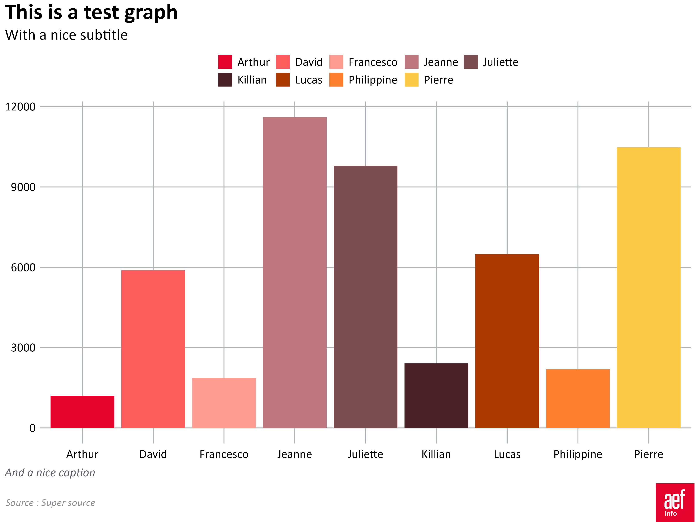

<!-- README.md is generated from README.Rmd. Please edit that file -->

# AEFPLOT 

<!-- badges: start -->

[](https://github.com/deroudilhep/aefplot/actions/workflows/R-CMD-check.yaml)
<!-- badges: end -->

Salut ! Ce *repository* contient les fonctions de la librairie R
`aefplot`. Une fois installée localement, cette librairie offre deux
outils pratiques pour créer et exporter des graphiques réalisés avec
`ggplot`, dans le style de l’agence de presse AEF info.

## Installer `aefplot`

`aefplot` n’est pas disponible dans le *Comprehensive R Network
Archive*. Pour l’installer, il faut procéder directement depuis GitHub
en utilisant la librairie `devtools`.

Si vous n’avez pas la librairie `devtools`, il faudra au préalable
l’installer en dé-commentant la première ligne du bloc de code
ci-dessous :

``` r
# install.packages("devtools")
devtools::install_github("deroudilhep/aefplot")
```

### La fonte Calibri

Le *package* `aefplot` utilise la fonte Calibri pour créer des
graphiques conformes à la charte AEF info. Le *package* ne chargera la
fonte et ne pourra l’utiliser pour les graphiques que si celle-ci est
déjà installée sur la machine de l’utilisateur. Si vous ne l’avez jamais
fait, il faut au préalable utiliser une fois la fonction `font_import()`
du *package* `extrafont`.

``` r
# install.packages("extrafont")
extrafont::font_import()
```

## Utiliser les fonctions

La librairie a deux fonctions : `aef_style()` et `finalise_aef_chart()`.

Un rapide tour d’horizon.

### `aef_style()`

`aef_style()` n’accepte aucun argument et s’ajoute à la “chaîne”
*ggplot* une fois le graphique créé. Cette fonction modifie la taille
des textes, leur police et leur couleur, les lignes des axes, leurs
titres ainsi que les autres éléments standards d’un graphique dans le
style d’AEF info.

Cette fonction est assez basique, et elle ne s’adapte pas au type de
graphique auquel on l’applique. Cela signifie que, dans certaines
situations, il faudra manuellement modifier quelques éléments du
graphique à l’aide de la fonction `theme()`.

Si les couleurs de la charte d’AEF info ne sont pas appliquées
automatiquement aux graphiques, elles sont cependant présentes dans le
*package*, et accessibles à l’utilisateur.

- `aefcolor_main`, les deux couleurs principales d’AEF ;
- `aefcolor_secondary`, cinq couleurs d’habillage secondaires ;
- `aefcolor_recommended`, la palette des six couleurs recommandées ;
- cinq dégradés de couleurs :
  - `aefcolor_gradientred`, cinq couleurs, du rouge pâle au rouge vif ;
  - `aefcolor_gradientblue`, cinq couleurs, du bleu pastel au bleu
    profond ;
  - `aefcolor_gradientorange`, cinq couleurs, du jaune orangé à l’orange
    foncé ;
  - `aefcolor_gradientviolet`, cinq couleurs, du violet poudré au mauve
    fumée ;
  - `aefcolor_gradientgreen`, cinq couleurs, du vert chlorophile au vert
    sapin.
- `aefcolor_divergent`, quatre couleurs du rouge au bleu ;
- `aefcolor_extended`, vingt couleurs à utiliser lorsqu’on a plus de six
  éléments à comparer dans un même graphique.

Exemple d’utilisation standard de la fonction `aef_style()` :

``` r
library(ggplot2)
library(aefplot)
sample_df <- fb_messages_sample_df
chart <- ggplot(sample_df, aes(x = sender_name, y = messages)) +
  geom_col(aes(fill = sender_name)) +
  scale_fill_manual(values = aefcolor_extended) +
  guides(fill = guide_legend(byrow = TRUE)) +
  labs(
    title = "This is a test graph",
    subtitle = "With a nice subtitle",
    caption = "And a nice caption"
  ) +
  aef_style()
```

### `finalise_aef_plot()`

`finalise_aef_plot()` prépare le graphique pour la publication et
l’exporte. Elle permet notamment d’ajouter une source, un logo, et
d’aligner les textes à gauche.

La fonction accepte six arguments : trois nécessaires et trois qui sont
définis par défaut, à moins d’être écrasés au moment de l’appel de la
fonction :

``` r
finalise_aef_chart(plot_name, 
                   source_name, 
                   save_filepath, 
                   width_pixels, 
                   height_pixels, 
                   logo_image_path)
```

- `plot_name`, la variable qui contient le graphique ggplot que l’on
  veut préparer à la publication et exporter ;
- `source_name`, un texte qui viendra après `Source :` en bas à gauche
  du graphique ;
- `save_filepath`, le chemin exact vers l’emplacement auquel on veut
  exporter le graphique, y compris le nom et le format de l’export (ex.
  : `graphique.png`) ;
- `width_pixels`, la largeur du graphique exporté, 800 pixels par défaut
  ;
- `height_pixels`, la hauteur du graphique exporté, 600 pixels par
  défaut ;
- `logo_image_path`, le chemin vers l’image que l’on veut insérer en bas
  à droite du graphique exporté. L’image doit être un PNG. Le logo d’AEF
  info est inséré par défaut.

Exemple d’utilisation standard de la fonction `finalise_aef_plot()`,
après avoir finalisé le graphique, lui avoir donné titre et sous-titre
et appliqué le thème AEF info grâce à la fonction `aef_style()` :

``` r
finalise_aef_chart(
  plot_name = chart,
  source_name = "Super source",
  save_filepath = paste0(tempdir(), "/filename.png")
)
```



Le code ci-dessus produira un graphique `filename.png`, à partir du
graphique contenu dans la variable `graph`. Le graphique fera 800 pixels
de large sur 600 pixels de haut, avec le logo d’AEF info inséré en bas à
droite, et annoté avec la source `"Super Source"`.

## Auteur

[@deroudilhep](mailto:pierre.deroudilhe@aefinfo.fr) @ AEF info
